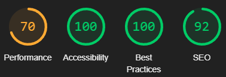

# Bootcamp Ada & Cielo

This project was developed by me, _Lucas Brittos_, according to the requirements you can find on the PDF file here in the root.

It follows the main standarts to make it the most accessible, according to the best practices and also reaching a high level of SEO.

- [Web Project](#web-project)
- [Starting the project](#starting-the-project)
- [How it looks like](#how-it-looks-like)
- [Stats](#stats)
- [Server](#server)

# Web project

These are the main tools used to develop:

- [NextJS](https://nextjs.org/): A ReactJS framework used to build modern intercafes;
- [TailwindCSS](https://tailwindcss.com/): A utility-first CSS framework that can be composed to build any design, directly in your markup;
- [Shadcn](https://ui.shadcn.com/): It's a collection of re-usable components built using Radix UI and TailwindCSS.

## Starting the project

_To run this project, you'll need Node in its **18.17.0** version at least._

1. Navigate to **_web_** folder through terminal;
1. **npm install** or **npm i** - _to install node_modules;_
1. **npm run dev** - _to run it on development;_
1. Open [**http://localhost:3000**](http://localhost:3000) - _so you'll be able to see its result_.

# How it looks like

You can see below an example of how it should look like after running it.

# Stats

This a brief stats from a report generated by Lighthouse:

<figure>
  
  <figcaption>Mobile stats based on Performance, accessibility, best practices and SEO</figcaption>
</figure>

<figure>
  
  <figcaption>Web stats based on Performance, accessibility, best practices and SEO</figcaption>
</figure>

# Server

This server was developed based on the JSON file which was made available by Cielo using NodeJS and Express.

To run this project, you'll need Node in its **18.17.0** version at least.

1. **Navigate** to _api_ through terminal;
2. **npm install** or **npm i** - _to install node_modules;_
3. **npm run start** - _to run it on development;_
4. It'll start serving the data to the frontend.
